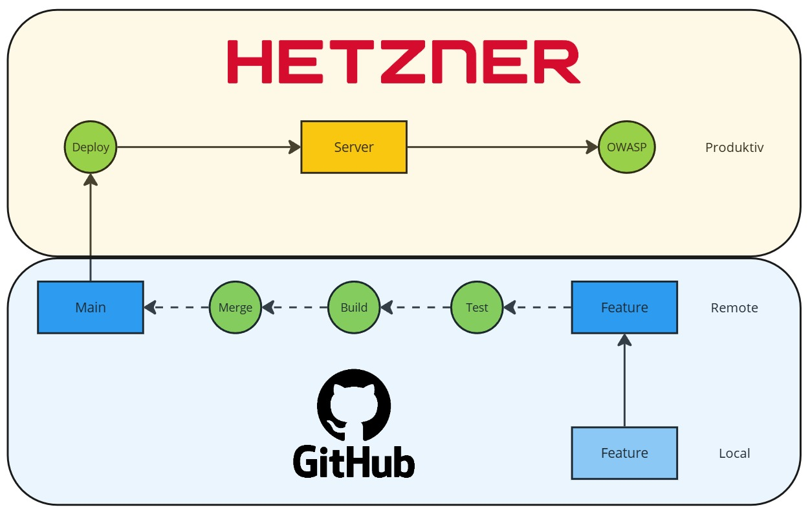

# Continuous Delivery Project
Goal of the application is the setup of a simple blog page taking continuous delivery into consideration. 

## Continuous Delivery Overview

The continuous deployment should be achieved via feature branches, that on push automatically trigger a simple test workflow, which in turn triggers a docker build workflow, which triggers a merge into main. On the merge into main deployment workflow is triggered which deploys to a vps server, afterwards a quick owasp security check is triggered on the production page.

## Used technologies
- Frontend
    - Next.js [Starter Guide](./frontend/blog/README.md)
    - Tailwind 
- Backend 
    - Strapi [Starter Guide](./backend/README.md)
    - SQLite Database
- Server
    - Hetzner VPS Droplet
- Automation
    - Terraform
    - Github Actions
    - Github Workflows
- Containerization
    - Docker
    - Docker Compose
    
## Local startup
1) Backend
    - cd foessl/backend
    - cp .env.example .env
    - npm install
    - npm run develop
    - insert local testdata via strapi gui to test application 
        - add one category
        - add one blog with relation to this category
        - go to settings roles public and allow find and findOne on category and blog
2) Frontend
    - cd foessl/frontend/blog
    - npm install
    - npm run dev

## Build Automation and Containerization
In this project two docker containers are built: one for the frontend and one for the backend. They can however communicate over a shared network. In the github workflow [build.yml](./.github/workflows/build.yml) both containers are initialized from their dockerfiles ([backend dockerfile](./backend/Dockerfile), [frontend dockerfile](./frontend/blog/Dockerfile)), including the necessary enviroment variables. After building the containers both are started to check wether the backend and frontend are accessible on their adresses. The workflow runs everytime when someone tries to interact with the main branch, not on seperate branches there, only simple tests are done.

## Test Automation
As in the build automation seperate tests for the frontend and backend are being used. Frontend is tested by mocking API Requests in a simple unit test fashion ([frontend tests](./frontend/blog/src/tests/api.test.ts)). For the backend tests are a little bit more complex and involve the correct setup of the content management system (set permissions on startup) to interact with the database. After the setup POST, PUT, GET, DELETE operations are tested ([backend tests](./backend/test/strapi_database.test.ts)). The [workflow](./.github/workflows/test.yml) that triggers these tests is run on each branch, since its very short and useful for initial feedback on the developers. 

## Automated Deployment
On pushes on branch main a github [workflow](/.github/workflows/deploy.yml) is used to automatically deploy the application to my hetzner droplet via compose. This works by first checking if the necessary dependencies exist on the droplet, else installing them. Then the necessary files are copied to the droplet as well as a .env file. Docker [compose](docker-compose.yml) then starts the backend, waits for it to be online and starts the frontend.

The database and uploads folder of the strapi backend are mounted to a physical volume on the server so data stays persistent when a new version is deployed. 

## Automated Code Analysis
The frontend of the project is a next.js typescript application that uses strict linting and type safety to ensure adherence to clean coding guidelines. Some of the enforced rules are: no any types, no unused parameters in methods - this also leads to some problems with some packages and therefore annotations like @tsignore have to be used on occasion. 

## Deployment and branching strategy
For this project, since its quite small only one environment is used. To make sure no errors occur in production, feature branches are used to implement new features. On push of a feature branch the test workflow is triggered, this does basic testing outside of docker. If this succeeds, the docker build workflow is triggered and both frontend and backend are started to check if everything works as it should. Only after those two checks an automatic merge to main workflow is triggered that merges the changes into main, this triggers the deployment workflow.

## Infrastructure as code via terraform
The projects [terraform workflow](/.github/workflows/terraform.yml) uses a [main.tf](/terraform/main.tf) file to connect to my hetzner account and creates a new resource via my api key. It also injects a new ssh key that is stored in github secrets and later on used for the automatic deployment.

## Security
All necessary keys are stored in Github Secrets and injected into the github workflows where necessary. Files like .env are not commited but ignored, however there is an example.env file to have some data for local testing.

After each deployment a quick OWASP scan is executed. The file is then uploaded to artifacts. [Click here](/documentation_media/zap-report.html) to see one of the scans. There certainly is a lot of potential to improve the security of the application.